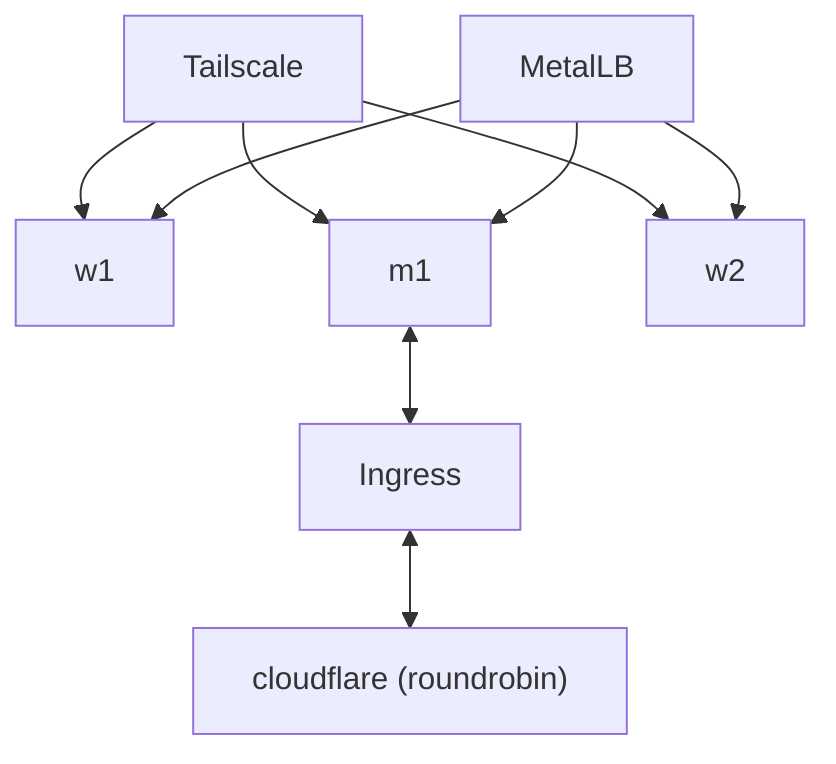

# mt190502's Kubernetes setup

## Setup

### Servers

- m1
  - Hostname: m1.srv.mtaha.dev
  - CPU: Intel Xeon (Skylake, IBRS, no TSX) (4) @ 2.10 GHz (x86_64)
  - RAM: 8 GB
  - OS: Fedora 41 Cloud Edition
  - Location: Hetzner Cloud
  - Machine: CX32

- w1
  - Hostname: w1.srv.mtaha.dev
  - CPU: ARM Cortex-A76 (4) @ 2.40 GHz (aarch64)
  - RAM: 8 GB
  - OS: Fedora 41 Cloud Edition
  - Location: Homelab
  - Machine: Raspberry Pi 5 - 8 GB

- w2
  - Hostname: w2.srv.mtaha.dev
  - CPU: Intel(R) Celeron(R) N3450 (4) @ 2.20 GHz (x86_64)
  - RAM: 8 GB
  - OS: Fedora 41 Cloud Edition
  - Location: Homelab
  - Machine: Zimaboard 832

### Workload



### Components

- AdGuard Home - For DNS and ad blocking
- Anki Server - For self-hosted Anki Flashcards
- ArgoCD - For GitOps, manages all the deployments (except itself and the CNI)
- Authentik - For OAuth2 and OIDC
- cert-manager - For managing certificates
- CloudNativePG - For PostgreSQL operator
- CodiMD - For note taking (simple)
- Commafeed - For RSS feeds
- DNSUtils - For troubleshooting DNS
- Filestash - For file sharing
- Gatus - For health checks
- Jellyfin - For media streaming
- Kubernetes Prometheus Stack - For monitoring and alerting
- Kubernetes Reflector - For syncing secrets across namespaces
- Longhorn - For storage provisioning
- Memos - For note taking (advanced)
- MetalLB - Load balancer, network policies
- Nextcloud - For file sharing
- Paperless-NGX - For document management
- PMM - For database monitoring
- Radicale - For CalDAV and CardDAV server
- Redmine - For project management
- Tailscale Operator - For VPN
- Traefik - Ingress controller
- Umami - For analytics
- Vaultwarden - For password management
- Vikunja - For self-hosted task management

## Installation

This setup uses Kustomize to manage the manifests. To install the setup, clone the repo and run the following commands:

```bash
kubectl kustomize --enable-helm | kubectl apply -f -
```

## Big Thanks

- Kreato's K8S Repository: <https://github.com/kreatoo/k8s/>
